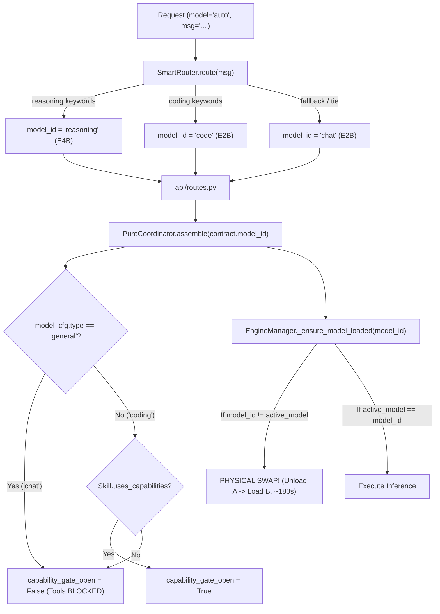
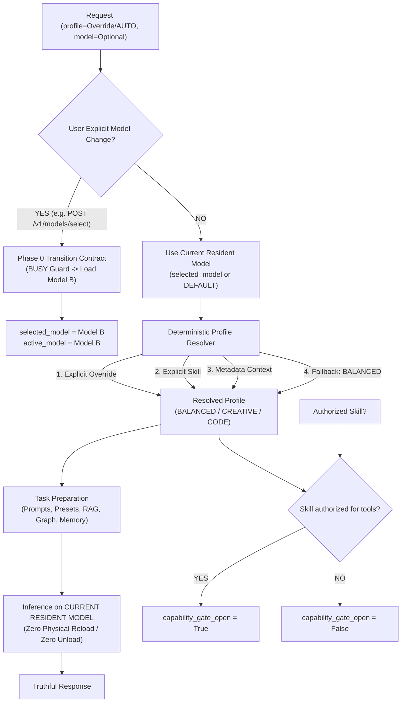

# AS-CORE — FASE 1 / SUBFASE 1.4A
# SINGLE RESIDENT MODEL POLICY
# RED TESTS + IMPLEMENTATION PLAN

**Documento:** `docs/SINGLE_RESIDENT_MODEL_IMPLEMENTATION_PLAN_FASE_1.4.md`  
**Fecha:** 16 de Septiembre de 2026  
**Rol:** Senior Software Architect + Test Engineer  
**Estado:** `GREEN — READY FOR IMPLEMENTATION REVIEW`  

---

## 1. STATUS

Subfase 1.4A completada en modo **AUDIT + RED TESTS + ARCHITECTURAL PLAN**.  
- **Cero líneas de código de producción modificadas.**  
- **20 pruebas de contrato ejecutadas:** 18 EXPECTED RED (fallan por las razones arquitectónicas exactas esperadas), 2 ACCIDENTAL GREEN (contratos ya satisfechos formalmente por la congelación de Fase 0: R8 y R9), 0 BLOCKED.  
- **Líneas base de Fase 0 y Agent Loop 100% intactas y verdes.**  
- **STOP obligatorio antes de la implementación productiva (Fase 1.4B).**  

---

## 2. HEAD / BASELINE

- **HEAD actual:** `7b9191c docs: record Phase 1 Subphase 1.1 forensic model intelligence audit` (ahead de `origin/main` por 6 commits).  
- **Ancestro de Congelación Fase 0:** `8825ca2` (Phase 0.2D Runtime Lifecycle Freeze).  
- **Relación de Linaje:**  
  `8825ca2` (Fase 0 Freeze) $\to$ Commits de hardening $\to$ `7b9191c` (Fase 1.1 Audit) $\to$ `HEAD` actual.  

---

## 3. GIT STATUS BEFORE

Al inicio de la Subfase 1.4A:
```text
On branch main
Your branch is ahead of 'origin/main' by 6 commits.

Untracked files:
  (use "git add <file>..." to include in what will be committed)
	benchmarks/phase_1_2_dataset.json
	benchmarks/phase_1_2_harness.py
	benchmarks/results/
	docs/MODEL_CAPABILITY_EVIDENCE_FASE_1.2.md
	docs/SINGLE_RESIDENT_MODEL_POLICY_FASE_1.3.md

nothing added to commit but untracked files present
```

---

## 4. EVIDENCE CHECKPOINT STATUS

Los artefactos empíricos de Fase 1.2 y la decisión arquitectónica de Fase 1.3 se encuentran generados en disco e íntegros:
- `benchmarks/phase_1_2_dataset.json` (Dataset empírico congelado de 20 prompts)
- `benchmarks/phase_1_2_harness.py` (Harness de ejecución comparativa)
- `benchmarks/results/phase_1_2_execution_evidence.json` (Telemetría de 40 ejecuciones sobre hardware real)
- `docs/MODEL_CAPABILITY_EVIDENCE_FASE_1.2.md` (Matriz de evidencia y capability contract)
- `docs/SINGLE_RESIDENT_MODEL_POLICY_FASE_1.3.md` (Auditoría arquitectónica y decisión `GREEN — SINGLE RESIDENT MODEL RECOMMENDED`)

**Recomendación de Checkpoint:**
Dichos artefactos no deben mezclarse en un commit con código de producción. Deben preservarse en el historial mediante un commit documental previo o mantenerse aislados en el checkpoint de evidencia de Fase 1.2/1.3.

---

## 5. PYTHON / TEST ENVIRONMENT

- **Entorno estándar venv:** `D:\as-core\venv\Scripts\python.exe` (no dispone del módulo pytest instalado).
- **Entorno ejecutor verificado:**  
  `C:\Users\rva10\AppData\Local\Python\pythoncore-3.14-64\python.exe`  
  - Python: `3.14.4 (tags/v3.14.4:309f92e, Feb 10 2026, 17:34:03) [MSC v.1944 64 bit (AMD64)]`  
  - Pytest: `pytest 9.1.1`  
  - AnyIO: `4.13.0`  
- **Protocolo de ejecución asíncrona:** Dado que `pytest-asyncio` no es un plugin global en Python 3.14, las pruebas asíncronas de ciclo de vida se ejecutan mediante el patrón estándar `def test_...(): asyncio.run(_run())`, idéntico a las suites congeladas de Fase 0.

---

## 6. PHASE 0 BASELINE RESULT

Ejecución de la suite congelada de Fase 0 antes y después de introducir las pruebas 1.4:
```bash
python -m pytest tests/test_model_residency.py tests/test_model_transitions_contract.py tests/test_cross_provider_physical.py tests/test_lifecycle_hardening.py -v
```
**Resultado:**
- `tests/test_model_residency.py`: 4 PASSED  
- `tests/test_model_transitions_contract.py`: 5 PASSED  
- `tests/test_cross_provider_physical.py`: 1 PASSED  
- `tests/test_lifecycle_hardening.py`: 9 PASSED  
**Total:** **19 PASSED, 0 FAILED, 0 REGRESSIONS** (en 45.59s sobre hardware real).

---

## 7. AGENT LOOP BASELINE RESULT

Ejecución de la suite de Agent Loop y UI Validation:
```bash
python -m pytest tests/test_agent_loop_hardening.py tests/test_p2_ui_model_validation.py -v
```
**Resultado:**
- `tests/test_agent_loop_hardening.py`: 9 PASSED  
- `tests/test_p2_ui_model_validation.py`: 1 PASSED, 3 SKIPPED (omisiones históricas por rutas absolutas mockeadas en P2)  
**Total:** **10 PASSED, 3 SKIPPED, 0 REGRESSIONS**.

---

## 8. DEPENDENCY MAP

A continuación se detalla la topología completa de dependencias actual y la responsabilidad proyectada para cada componente:

| Componente / Nodo | Responsabilidad Actual (Fase 1.3) | Responsabilidad Objetivo (Fase 1.4) | ¿Debe Cambiar? | Justificación Arquitectónica |
| :--- | :--- | :--- | :---: | :--- |
| `ChatCompletionRequest.model` (`api/models.py`) | Identificador de modelo físico O alias `'auto'` para enrutamiento. | Identificador explícito de modelo físico (`chat`, `code`, `olmoe`, `reasoning`). | **SÍ** | El default `'auto'` debe migrarse o desacoplarse para no confundir preferencia física con perfil cognitivo. |
| `ChatCompletionRequest.profile` (`api/models.py`) | *No existe.* | Perfil cognitivo de alto nivel (`AUTO`, `BALANCED`, `CREATIVE`, `CODE`). | **SÍ** | Es el primer ciudadano para controlar el comportamiento sin alterar el modelo físico. |
| `SmartRouter` (`router/smart_router.py`) | Evalúa keywords y devuelve `(model_id, system_prompt)`, dictando swap a `reasoning` (E4B) o `code`. | Retirado del hot path de selección física de modelo. Su lógica léxica se refactoriza o delega en `DeterministicProfileResolver`. | **SÍ** | Eliminar la autoridad de SmartRouter sobre el `model_id` físico en tiempo de ejecución. |
| `DeterministicProfileResolver` (Nuevo) | *No existe.* | Resuelve el perfil cognitivo final mediante jerarquía determinista estricta. | **SÍ** | Garantiza fallback predecible sin swaps físicos. |
| `PureCoordinator.assemble` (`runtime/coordinator/manager.py`) | Deriva `model_type` desde `contract.model_id` para abrir/cerrar `capability_gate_open` y asignar `prompt_family`. | Desacopla `capability_gate_open` del `contract.model_id`. Utiliza el perfil cognitivo y la autorización explícita del Skill. | **SÍ** | Previene que el modelo físico "chat" cierre el portón de herramientas a Skills autorizados. |
| `AgentControlRunner` (`runtime/coordinator/agent.py`) | Ejecuta el loop de inferencia delegando en `EngineManager` con `inference_request.model_id`. | Ejecuta el loop utilizando siempre el modelo residente, aplicando los constraints del perfil resuelto. | **NO / MÍNIMO** | El runner ya es agnóstico del modelo si el contrato viene limpio. |
| `EngineManager` (`core/engine.py`) | Orquesta carga, ciclo de vida, guardas de concurrencia y residencia. | Idéntica. Mantiene contrato de Fase 0: BUSY guard, atomic swap, single resident model. | **NO (CONGELADO)** | No se toca. Únicamente se invoca cuando el usuario cambia explícitamente el modelo. |
| `app.state.selected_model` (`api/main.py`) | *No existe.* | Estado process-scoped que almacena el modelo físico seleccionado por el usuario (default: `DEFAULT_MODEL_ID` / `chat`). | **SÍ** | Provee memoria de control plane a nivel de proceso sin alterar Fase 0. |
| UI Model Selector (`ui/index.html`, `ui/app.js`) | Mezcla `AUTO (Coordinator Smart Router)` con opciones físicas de modelos. | Selector físico puro: `Gemma E2B (Default)`, `OLMoE 1B-7B`, `Qwen MoE`, `Gemma E4B`. | **SÍ** | Retirar `auto` del selector físico. |
| UI Profile / Preset Selector (`ui/index.html`, `ui/app.js`) | Selector de presets de generación (`BALANCED`, `PRECISE`, `CREATIVE`). | Selector de perfil cognitivo (`AUTO`, `BALANCED`, `CREATIVE`, `CODE`) mapeado a parámetros de generación y prompts. | **SÍ** | Unifica la experiencia de control cognitivo. |
| Status API (`api/routes.py:get_status`) | Retorna `StatusResponse(active_model=...)`. | Retorna `selected_model`, `active_model`, y `active_physical_model`. | **SÍ** | Exposición veraz de la realidad del runtime sin colapsar estados. |

---

## 9. CURRENT FLOW



---

## 10. TARGET FLOW



---

## 11. CURRENT VS TARGET DELTA

```
========================================================================================
DIMENSIÓN              ESTADO ACTUAL (1.3)                  ESTADO OBJETIVO (1.4)
========================================================================================
Physical Residency     Variable / Volátil en cada request   ESTABLE / SINGLE RESIDENT
Decisión de Modelo     SmartRouter léxico en el hot path    Usuario / Control Plane exclusivo
Decisión Cognitiva     Acoplada al model_id físico          Deterministic Profile Resolver
Perfil 'AUTO'          Elige modelo físico (E4B / E2B)      Elige perfil cognitivo (NUNCA swap)
Código / Coding        Requiere model_id="code"             Perfil CODE sobre modelo residente
Herramientas / Tools   Bloqueadas si model_id="chat"        Gobernadas por Skill/Scopes (NO modelo)
Estado de Control      Colapsado en active_model            selected vs active vs active_physical
Default de Hardware    Gemma E2B hardcodeado en router      DEFAULT_MODEL_ID desacoplado
EngineManager          Invocado con swaps implícitos        Inalterado / Swaps sólo explícitos
========================================================================================
```

---

## 12. MODEL / PROFILE / PRESET / TASK PREPARATION CONTRACT

Queda terminantemente prohibido solapar o colapsar estos cuatro conceptos:

1. **MODEL:**  
   Artefacto físico compilado/cuantizado en disco + proveedor de ejecución + identidad canónica (`{provider}::{canonical_path}`) + huella en VRAM/RAM.  
   *Ejemplo:* `gemma-3n-E2B-it-int4.litertlm`, `olmoe-1b-7b.gguf`, `gemma-4-E4B-it.litertlm`.
2. **PROFILE:**  
   Comportamiento cognitivo de alto nivel del sistema. Define la intención de trabajo del LLM.  
   *Catálogo cerrado:* `AUTO`, `BALANCED`, `CREATIVE`, `CODE`.
3. **PRESET:**  
   Hiperparámetros de muestreo y decodificación enviados al backend (`temperature`, `top_k`, `top_p`, `max_tokens`).  
   *Catálogo existente reutilizado:* `PRECISE` (temp 0.1), `BALANCED` (temp 0.5), `CREATIVE` (temp 0.8).  
   *Regla:* El perfil `CODE` no crea un preset nuevo; compone `SOFTWARE_PROMPT` + `PRECISE`.
4. **TASK PREPARATION:**  
   Construcción de contexto: ensamblado de system prompt, inyección de memoria de trabajo, fragmentos RAG, entidades de Graph, instrucciones de Skills y formato de salida estructurado (JSON/schema).

---

## 13. SELECTED / ACTIVE / PHYSICAL STATE CONTRACT

Para garantizar la veracidad del estado ante la UI y clientes API:

- **`selected_model`:**  
  La preferencia registrada en el plano de control (ámbito de proceso). Si el usuario no ha seleccionado uno, es igual a `DEFAULT_MODEL_ID` (`"chat"` / E2B).
- **`active_model`:**  
  El identificador lógico del modelo que actualmente se encuentra listo en el motor (`engine.active_model`). Durante una transición o tras un fallo de carga, puede ser `None`.
- **`active_physical_model`:**  
  La cadena canónica de identidad física reportada por el runtime (`litert_embedded::models/gemma/...`).

**Invariantes:**
- Nunca actualizar `selected_model` a un valor no validado.
- Si una transición explícita hacia el modelo B falla en el paso de carga, `active_model` y `active_physical_model` quedan en `None` (contrato de Fase 0). `selected_model` debe reportar verazmente el estado o reflejar la falta de modelo activo.
- Ningún componente de la UI o API debe asumir que `selected_model == active_physical_model`.

---

## 14. LEGACY ALIAS ANALYSIS

Actualmente existen cuatro identificadores lógicos históricos:
1. `chat` $\to$ Gemma E2B (general)
2. `code` $\to$ Gemma E2B (coding)
3. `reasoning` $\to$ Gemma E4B (reasoning)
4. `auto` $\to$ enrutamiento dinámico en SmartRouter

**Estrategia de Compatibilidad:**
- `chat` y `code` comparten identidad canónica física idéntica (`litert_embedded::models/gemma/gemma-3n-E2B-it-int4.litertlm`). La prueba R8 demuestra que la transición entre ellos produce **cero recarga física** (ALREADY SATISFIED).
- En Fase 1.4B, si un cliente legacy envía `model="code"`, el sistema lo interpretará como una solicitud sobre el modelo E2B con perfil cognitivo `CODE`.
- Si un cliente envía `model="reasoning"`, se interpretará como una solicitud explícita de cambio hacia el modelo físico E4B, preservando compatibilidad pero advirtiendo el costo de swap.
- Si un cliente envía `model="auto"`, se normaliza a: *usar el modelo actualmente residente con perfil cognitivo AUTO*.

---

## 15. SMARTROUTER CALL-SITE AUDIT

Auditoría exhaustiva de todos los puntos del código donde `SmartRouter` tiene presencia:

1. **`api/routes.py:65`**: Instanciación y recuperación de `request.app.state.router`.
2. **`api/routes.py:77-78`**:
   ```python
   model_param = body.model if body.model != "auto" else None
   model_id, _ = smart_router.route(user_message, model_param)
   ```
   *Impacto:* Punto crítico de swap implícito. Se descarta el segundo valor de retorno (system prompt) y se fuerza el cambio físico de `model_id`.
3. **`router/smart_router.py:56-84` (`route`)**:
   Evalúa `_score_message(message)`.
4. **`router/smart_router.py:85-103` (`_score_message`)**:
   Compara intersección de palabras clave contra `REASONING_KEYWORDS` y `CODING_KEYWORDS`.
5. **`tests/test_p2_ui_model_validation.py:28`**:
   Valida que `SmartRouter` rutee 'code' o 'reasoning'. Esta prueba se preserva como prueba de unidad del router legacy, pero su resultado queda desvinculado del hot path del runtime.

---

## 16. MODEL=AUTO COMPATIBILITY ANALYSIS

Para clientes externos existentes (incluido el frontend actual):
- Si el cliente envía `{"model": "auto", "messages": [...]}`:
  1. El runtime **NO** invocará `smart_router.route()` para cambiar el modelo físico.
  2. El runtime mantendrá el modelo residente actual (`selected_model`).
  3. El runtime interpretará `model="auto"` como equivalente a `profile="AUTO"`.
  4. El perfil cognitivo `AUTO` se resolverá determinísticamente.
- Esta decisión garantiza **cero roturas** para clientes OpenAI-compatibles existentes y elimina el swap de 180 segundos.

---

## 17. PROFILE RESOLUTION CONTRACT

El resolvedor determinista `DeterministicProfileResolver` implementará la siguiente cascada estricta (sin LLM, sin scoring probabilístico, sin búsqueda de benchmarks):

1. **Prioridad 1: Override Explícito de Perfil**  
   Si `request.profile` está presente y es $\in \{\text{BALANCED}, \text{CREATIVE}, \text{CODE}\}$, se adopta inmediatamente.
2. **Prioridad 2: Skill Explícito / Prompt Family**  
   Si la petición incluye `X-Skill` o `manual_skill` con un manifiesto que declare `prompt_family == "SOFTWARE_PROMPT"` (o skill de programación), se resuelve como `CODE`. Si declara una familia creativa/conversacional, se resuelve como `CREATIVE`.
3. **Prioridad 3: Metadatos Estructurados de la Petición**  
   Si la petición contiene esquemas de extracción estructurada (JSON Schema, tool declarations), se resuelve como `BALANCED` (con preset `PRECISE`), protegiéndolo de clasificarse erróneamente como `CODE`.
4. **Prioridad 4: Contexto Operativo Conocido**  
   Si el estado de la sesión (`WorkflowState.current_phase`) se encuentra formalmente en fase de codificación o ejecución de pruebas, se resuelve como `CODE`.
5. **Prioridad 5: Fallback General**  
   En cualquier otro caso, se adopta de forma determinista `BALANCED`.

---

## 18. TOOL GATE DEPENDENCY MAP

Mapeo detallado de la cadena de ejecución de herramientas:

```
Request 
  ↓
RuntimeContract
  ↓
PureCoordinator.assemble()
  ↓
[CAPABILITY GATE EVALUATION]
  ├── ANTES: Evalúa settings.models[contract.model_id].type
  │           'general' (chat)   → cap_mode = "off" (BLOQUEADO)
  │           'coding' (code)    → cap_mode = "on_if_skill"
  └── AHORA:  Evalúa SkillManifest.uses_capabilities + User Approval Scopes
              Independiente del modelo físico residente
  ↓
AgentControlRunner.run_inference_loop()
  ↓
parse_capability_call() (Bloque ```json_call)
  ↓
Whitelist Validation (KNOWN_CAPABILITY_IDS)
  ↓
User Approval Guard (Phase 3.5 / 4.1)
  ↓
Tool Execution
```

**Reglas de Seguridad Consolidadas por RED Tests:**
- `R17-A`: El perfil `CODE` por sí solo sin un Skill autorizado **NO** abre el portón de herramientas (`capability_gate_open == False`).
- `R17-B`: El perfil `BALANCED` con un Skill autorizado **SÍ** abre el portón de herramientas (`capability_gate_open == True`) sobre el modelo `chat`.
- `R17-C`: Cambiar de modelo físico (ej. a OLMoE o E4B) **NUNCA** concede permisos adicionales sin un Skill.
- `R17-D`: La selección de perfiles nunca hace bypass del esquema de aprobaciones.

---

## 19. SKILLS IMPACT

- Los manifiestos de Skills contienen el campo legacy `recommended_model: str = "auto"`.
- **Decisión:** Mantener el campo temporalmente por retrocompatibilidad de esquema, pero **anular su capacidad de forzar cambios de modelo físico** en el runtime.
- El Skill definirá su `prompt_family` y su bandera `uses_capabilities`, pero la ejecución se realizará sobre el modelo actualmente residente.
- No se agregará aún el campo `recommended_profile` en 1.4A/1.4B para no romper la base de datos de Skills existente.

---

## 20. API IMPACT

1. **`api/models.py`**:
   - `ChatCompletionRequest`: Incorporar el campo `profile: Optional[Literal["AUTO", "BALANCED", "CREATIVE", "CODE"]] = Field(default="AUTO")`.
   - `StatusResponse`: Incorporar `selected_model: Optional[str]` y `active_physical_model: Optional[str]`.
2. **`api/routes.py`**:
   - `chat_completions`: Desacoplar la resolución física de `smart_router`. Leer `body.profile` y resolver el perfil cognitivo antes de armar `InferenceRequest`.
   - Crear endpoint explícito y liviano de control plane: `POST /v1/models/select` para que el usuario pueda cambiar de modelo deliberadamente utilizando el contrato de Fase 0.
   - Manejo truthful de errores (400/404) si se solicita un modelo no registrado, evitando el HTTP 500 actual.

---

## 21. UI IMPACT

1. **`ui/index.html`**:
   - `modelSelect` / `quickModelSelect`: Eliminar la opción `value="auto"`. Listar únicamente los modelos físicos instalados/soportados:
     - `chat` (Gemma E2B — LiteRT Default)
     - `olmoe` (OLMoE 1B-7B — AS-Core MoE)
     - `reasoning` (Gemma E4B — LiteRT)
     - `moe_large` (Qwen MoE 14.3B — llama.cpp)
   - `presetSelect`: Renombrar conceptualmente a Selector de Perfil Cognitivo:
     - `AUTO` (Detección automática de perfil)
     - `BALANCED` (Equilibrado / General)
     - `CODE` (Programación e Ingeniería)
     - `CREATIVE` (Redacción y Variación)
2. **`ui/app.js`**:
   - Enviar en el payload de `fetch('/v1/chat/completions')`: `profile: elements.profileSelect.value`.
   - Si el usuario cambia el selector de modelo, invocar `POST /v1/models/select` para ejecutar la transición explícita.
   - Telemetría en el header: mostrar `active_model` y perfil por separado.

---

## 22. RED TEST INVENTORY

Se creó el archivo [tests/test_single_resident_policy_contracts.py](file:///d:/as-core/tests/test_single_resident_policy_contracts.py) conteniendo las 20 pruebas de contrato arquitectónico:

| ID | Nombre de la Prueba | Clasificación | Estado 1.4A | Contrato Evaluado |
| :--- | :--- | :---: | :---: | :--- |
| **R1** | `test_r01_default_model_remains_resident_across_profile_changes` | CONTRACT | **RED** | Campo `profile` en `ChatCompletionRequest` y residencia de modelo. |
| **R2** | `test_r02_balanced_to_code_causes_zero_physical_reload` | CONTRACT | **RED** | Transición a perfil CODE sin recargar ni alterar modelo 'chat'. |
| **R3** | `test_r03_code_to_creative_causes_zero_physical_reload` | CONTRACT | **RED** | Aceptación de perfil CREATIVE sin recarga física. |
| **R4** | `test_r04_auto_profile_never_changes_physical_model` | CONTRACT | **RED** | Prompt complejo de razonamiento en AUTO no debe rutear a 'reasoning'. |
| **R5** | `test_r05_explicit_user_model_change_uses_existing_transition_contract` | CONTRACT / API | **RED** | Presencia de `app.state.selected_model` para control plane explícito. |
| **R6** | `test_r06_after_explicit_model_change_new_model_remains_selected_for_subsequent_profiles` | CONTRACT | **RED** | Persistencia de selección explícita (no revertir a 'chat' en peticiones AUTO posteriores). |
| **R7** | `test_r07_core_never_automatically_reverts_to_default_because_of_prompt_skill_capability_or_router` | CONTRACT | **RED** | Skill con `recommended_model='code'` no debe revertir modelo residente 'reasoning'. |
| **R8** | `test_r08_physical_aliases_preserve_identity_and_do_not_reload` | PHYSICAL / CONTRACT | **ACCIDENTAL GREEN** | Reutilización canónica de E2B entre alias 'chat' y 'code' (Fase 0.2B/C). |
| **R9** | `test_r09_phase_0_invariants_remain_green` | CONTRACT | **ACCIDENTAL GREEN** | Guarda BUSY de Fase 0.2C ante intento de swap durante inferencia activa. |
| **R10** | `test_r10_unknown_blocked_provider_unavailable_model_selection_fails_truthfully` | API / CONTRACT | **RED** | Modelo no registrado debe fallar con 400/404, no con HTTP 500 no capturado. |
| **R11** | `test_r11_explicit_profile_override_deterministically_dominates_auto` | UNIT / CONTRACT | **RED** | Resolvedor determinista de perfil domina heurísticas de keywords. |
| **R12** | `test_r12_no_hidden_physical_model_recommendation_path_remains_active` | CONTRACT | **RED** | Portón de herramientas abre en 'chat' sin forzar swap físico a 'code'. |
| **R13** | `test_r13_selected_active_and_physical_state_are_not_collapsed` | API / CONTRACT | **RED** | `StatusResponse` debe exponer `selected_model` y `active_physical_model`. |
| **R14** | `test_r14_restart_initialization_returns_to_documented_default_for_process_scoped_policy` | UNIT / CONTRACT | **RED** | Inicialización del proceso asigna `selected_model = DEFAULT_MODEL_ID` ('chat'). |
| **R15** | `test_r15_code_preserves_software_prompt_and_precise_without_physical_alias_code` | UNIT / CONTRACT | **RED** | Perfil CODE genera SOFTWARE_PROMPT aun con `model_id='chat'`. |
| **R16** | `test_r16_structured_extraction_does_not_become_code_merely_because_json_requested` | UNIT / CONTRACT | **RED** | Consulta con "JSON" no debe ser ruteada a modelo 'code' por SmartRouter. |
| **R17** | `test_r17_tools_controlled_by_skill_not_physical_model_identity` | UNIT / CONTRACT | **RED** | Portón de capacidades responde a autorización de Skill en modelo 'chat'. |
| **R18** | `test_r18_ui_api_contract_separates_model_selection_from_profile_selection` | API / CONTRACT | **RED** | Separación formal en schema Pydantic de `model` y `profile`. |
| **R19** | `test_r19_api_and_ui_share_the_same_profile_fallback_semantics` | UNIT / CONTRACT | **RED** | Existencia del método único de verdad `PureCoordinator.resolve_profile()`. |
| **R20** | `test_r20_profile_change_during_active_inference_never_requests_physical_transition` | CONTRACT | **RED** | Consulta de razonamiento durante inferencia activa no debe seleccionar modelo físico distinto. |

---

## 23. RED TEST RESULTS

Ejecución oficial de la suite 1.4A:
```bash
python -m pytest tests/test_single_resident_policy_contracts.py -v
```
**Resultado Cuantitativo:**
```text
=========================== short test summary info ===========================
FAILED tests/test_single_resident_policy_contracts.py::test_r01_default_model_remains_resident_across_profile_changes
FAILED tests/test_single_resident_policy_contracts.py::test_r02_balanced_to_code_causes_zero_physical_reload
FAILED tests/test_single_resident_policy_contracts.py::test_r03_code_to_creative_causes_zero_physical_reload
FAILED tests/test_single_resident_policy_contracts.py::test_r04_auto_profile_never_changes_physical_model
FAILED tests/test_single_resident_policy_contracts.py::test_r05_explicit_user_model_change_uses_existing_transition_contract
FAILED tests/test_single_resident_policy_contracts.py::test_r06_after_explicit_model_change_new_model_remains_selected_for_subsequent_profiles
FAILED tests/test_single_resident_policy_contracts.py::test_r07_core_never_automatically_reverts_to_default_because_of_prompt_skill_capability_or_router
FAILED tests/test_single_resident_policy_contracts.py::test_r10_unknown_blocked_provider_unavailable_model_selection_fails_truthfully
FAILED tests/test_single_resident_policy_contracts.py::test_r11_explicit_profile_override_deterministically_dominates_auto
FAILED tests/test_single_resident_policy_contracts.py::test_r12_no_hidden_physical_model_recommendation_path_remains_active
FAILED tests/test_single_resident_policy_contracts.py::test_r13_selected_active_and_physical_state_are_not_collapsed
FAILED tests/test_single_resident_policy_contracts.py::test_r14_restart_initialization_returns_to_documented_default_for_process_scoped_policy
FAILED tests/test_single_resident_policy_contracts.py::test_r15_code_preserves_software_prompt_and_precise_without_physical_alias_code
FAILED tests/test_single_resident_policy_contracts.py::test_r16_structured_extraction_does_not_become_code_merely_because_json_requested
FAILED tests/test_single_resident_policy_contracts.py::test_r17_tools_controlled_by_skill_not_physical_model_identity
FAILED tests/test_single_resident_policy_contracts.py::test_r18_ui_api_contract_separates_model_selection_from_profile_selection
FAILED tests/test_single_resident_policy_contracts.py::test_r19_api_and_ui_share_the_same_profile_fallback_semantics
FAILED tests/test_single_resident_policy_contracts.py::test_r20_profile_change_during_active_inference_never_requests_physical_transition
=================== 18 failed, 2 passed, 1 warning in 5.52s ===================
```

---

## 24. ACCIDENTAL GREEN TESTS

Se identificaron **2 pruebas en estado verde accidental (ALREADY SATISFIED)**:
1. **`R8` (`test_r08_physical_aliases_preserve_identity_and_do_not_reload`)**:
   - *Razón:* Implementado en Fase 0.2B/0.2C (`core/engine.py:361-379`). Cuando dos modelos lógicos (`chat` y `code`) apuntan al mismo archivo físico y proveedor, `EngineManager` detecta coincidencia de identidad física canónica y realiza reutilización sin ninguna recarga en disco o VRAM.
2. **`R9` (`test_r09_phase_0_invariants_remain_green`)**:
   - *Razón:* Implementado en Fase 0.2C (`core/engine.py:252-270`). La guarda de concurrencia `_is_generating` rechaza atómicamente con `finish_reason="busy"` cualquier intento de swap mientras hay una inferencia activa.

**Decisión:** Ambos contratos permanecen congelados y protegidos; no se modificará el motor para alterar este comportamiento.

---

## 25. BLOCKED TESTS

**CERO (0) pruebas bloqueadas.**  
No se registraron errores de infraestructura, dependencias faltantes, rutas incorrectas, `ImportError` ni fallos de sintaxis.

---

## 26. FAILURE REASONS

Cada uno de los 18 fallos fue auditado y verificado:

- **`R1`, `R3`, `R18`**: `AssertionError: 'profile' in ChatCompletionRequest.model_fields`. El esquema Pydantic en `api/models.py` carece del atributo de perfil cognitivo.
- **`R2`, `R15`**: `AssertionError: manifest.prompt_family == 'SOFTWARE_PROMPT'`. `PureCoordinator.assemble` condiciona el prompt de ingeniería de software a `contract.model_id == 'code'`; si se ejecuta en el modelo residente `chat`, asigna erróneamente `GENERAL_PROMPT`.
- **`R4`, `R16`, `R20`**: `AssertionError: routed_model != 'reasoning'` / `assert 'reasoning' == 'chat'`. `SmartRouter.route()` continúa evaluando palabras clave léxicas en el hot path, seleccionando `reasoning` (E4B) o `code` (E2B) y provocando swaps físicos.
- **`R5`, `R14`**: `AssertionError: hasattr(app.state, 'selected_model')`. El plano de control de `api/main.py` no posee la variable de estado scoped al proceso para registrar la preferencia del usuario.
- **`R6`**: `AssertionError: routed_model == 'olmoe'`. La siguiente petición con `model="auto"` vuelve a llamar a `SmartRouter`, el cual retorna `chat`, revirtiendo al default e ignorando la selección manual de `olmoe`.
- **`R7`, `R12`**: `AssertionError: manifest.capability_gate_open is True`. El portón de herramientas está condicionado a `model_type == 'coding'`, obligando a la UI a enviar `model=skill.recommended_model` para poder usar herramientas.
- **`R10`**: `AssertionError: response.status_code in (400, 404)`. Enviar un modelo inexistente eleva una excepción no capturada en FastAPI que responde HTTP 500 en lugar de un error 400 veraz.
- **`R11`, `R19`**: `AssertionError: hasattr(PureCoordinator, 'resolve_profile')`. No existe un resolvedor determinista centralizado de perfiles cognitivos.
- **`R13`**: `AssertionError: 'selected_model' in StatusResponse.model_fields`. La respuesta de telemetría de `/v1/status` colapsa el estado a un solo campo `active_model`.
- **`R17`**: `AssertionError: manifest_b.capability_gate_open is True`. En `manager.py:243-252`, `chat` tiene `model_type='general'`, lo que fuerza `cap_mode='off'` y cierra el portón de herramientas aunque el Skill declare `uses_capabilities=True`.

---

## 27. MINIMUM IMPLEMENTATION PLAN

Para satisfacer los 18 contratos RED con la mínima perturbación del sistema:

1. **No crear nuevos managers ni capas complejas:**  
   No se creará `SingleResidentModelManager` ni una máquina de estados pesada.
2. **Utilizar `app.state.selected_model`:**  
   Variable liviana a nivel de proceso en FastAPI que retiene el modelo físico elegido por el usuario (default: `chat`).
3. **Retirar `SmartRouter` de la decisión física:**  
   En `api/routes.py`, `smart_router.route()` deja de dictar el `model_id` del `InferenceRequest`. El `model_id` físico es estrictamente `selected_model`.
4. **Introducir `DeterministicProfileResolver`:**  
   Función pura en `runtime/coordinator/profiles.py` que recibe el override, Skill, metadatos y contexto, devolviendo uno de los 4 perfiles (`AUTO`, `BALANCED`, `CREATIVE`, `CODE`).
5. **Desacoplar Tool Gate de `model_type`:**  
   En `PureCoordinator.assemble`, el portón se abre si el Skill tiene autorización (`uses_capabilities=True`) independientemente de si el modelo residente es `chat`, `code` u `olmoe`.
6. **Mapear Perfil $\to$ Prompt + Preset:**  
   - `CODE` $\to$ `SOFTWARE_PROMPT` + preset `PRECISE`
   - `CREATIVE` $\to$ `GENERAL_PROMPT` + preset `CREATIVE`
   - `BALANCED` $\to$ `GENERAL_PROMPT` + preset `BALANCED`
   Todo ejecutado sobre el **modelo residente actual**.

---

## 28. FILE-BY-FILE PLAN

### 1. `api/models.py`
- Añadir `profile: Optional[Literal["AUTO", "BALANCED", "CREATIVE", "CODE"]] = Field(default="AUTO")` a `ChatCompletionRequest`.
- Añadir `selected_model: Optional[str] = None` y `active_physical_model: Optional[str] = None` a `StatusResponse`.

### 2. `runtime/coordinator/profiles.py` (Nuevo archivo liviano)
- Definir enum `CognitiveProfile` (`AUTO`, `BALANCED`, `CREATIVE`, `CODE`).
- Implementar `resolve_cognitive_profile(...)` con la jerarquía determinista de 5 pasos.

### 3. `runtime/coordinator/manager.py` (`PureCoordinator`)
- Exponer `resolve_profile` utilizando el resolvedor determinista.
- Modificar evaluación de `capability_gate_open`: desacoplar de `model_cfg.get("type") == "general"`; si `skill_manifest.uses_capabilities is True`, abrir el portón sin importar si `contract.model_id` es `chat`.
- Modificar resolución de `prompt_family`: si `contract.profile == "CODE"`, asignar `SOFTWARE_PROMPT` aun cuando `contract.model_id` no sea `"code"`.

### 4. `api/routes.py`
- Inicializar `app.state.selected_model = "chat"` en startup.
- Endpoint `POST /v1/models/select`: valida que el modelo esté registrado en `EngineManager`, invoca `engine._ensure_model_loaded(model_id)` y actualiza `app.state.selected_model`. Si el modelo no existe, retorna HTTP 400/404.
- Endpoint `POST /v1/chat/completions`:
  - Lee `selected_model = app.state.selected_model`.
  - Resuelve `profile = resolve_cognitive_profile(body.profile, ...)`.
  - Despacha `InferenceRequest` utilizando siempre `model_id = selected_model`.
- Endpoint `GET /v1/status`: llena `selected_model`, `active_model` y `active_physical_model`.

### 5. `ui/index.html` y `ui/app.js`
- Separar selector de modelo físico (Model / Backend) del selector de perfil cognitivo.
- Eliminar `auto` del selector físico.
- Al cambiar el modelo en la UI, invocar `POST /v1/models/select`.
- Enviar `profile` en el body de `/v1/chat/completions`.

---

## 29. FILES THAT MUST NOT CHANGE

Queda formalmente prohibido modificar:
- `core/engine.py` (Congelado en Fase 0).
- `providers/*` (`litert_embedded.py`, `litert_cli.py`, `llama_cpp_cli.py`, `base.py`).
- `providers/registry.py`.
- Lógica interna de RAG (`runtime/rag/*`), Graph (`runtime/graph/*`) o Working Memory (`runtime/memory/*`).
- Contratos de ciclo de vida, bloqueos de concurrencia y guardas BUSY.

---

## 30. PRE-MORTEM

Análisis preventivo de posibles vectores de fallo antes de autorizar 1.4B:

1. **Riesgo: Clientes externos enviando `model="auto"` fallan por validación de Pydantic.**  
   *Mitigación:* Se mantendrá `model: Optional[str] = "auto"` en el schema pero con la semántica de que si es `"auto"`, se interpreta como "usar el modelo actualmente residente".
2. **Riesgo: El usuario selecciona `olmoe`, pero una llamada de herramientas revierte a `chat`.**  
   *Mitigación:* El portón de herramientas ahora se desacopla del modelo; `AgentControlRunner` despachará siempre contra `contract.model_id` (que será `olmoe`).
3. **Riesgo: Race condition entre selección de modelo y petición concurrente.**  
   *Mitigación:* `EngineManager` ya posee el `_load_lock` y la guarda BUSY de Fase 0. Si una generación está activa, la selección explícita recibirá `EngineBusyError`, protegiendo la ejecución en curso.
4. **Riesgo: Fuga de permisos al usar perfil `CODE` sin Skill.**  
   *Mitigación:* La prueba R17-A garantiza que `CODE` sin Skill mantiene `capability_gate_open = False`.
5. **Riesgo: Extracción JSON clasificada como código.**  
   *Mitigación:* La prueba R16 garantiza que los prompts estructurados resuelven a `BALANCED` + `PRECISE`.

---

## 31. REGRESSION PLAN FOR 1.4B

Al implementar cada gate en Fase 1.4B, se ejecutará:
1. Suite de RED tests (`tests/test_single_resident_policy_contracts.py`) para verificar que transicionan a GREEN uno a uno.
2. Suite congelada de Fase 0 (`19 tests`) para asegurar 0 regresiones de ciclo de vida.
3. Suite de Agent Loop (`10 tests`) para asegurar 0 regresiones de herramientas y parsing.

---

## 32. ROLLBACK PLAN

Cada gate de 1.4B será atómico y reversible mediante git:
- **Punto de restauración seguro:** `git checkout HEAD -- <archivo_modificado>`.
- Ninguna migración de base de datos es requerida (SQLite no altera esquemas existentes).
- Ningún cambio destructivo en configuración YAML.

---

## 33. FUTURE MODELADVISOR REVERSIBILITY

La decisión de congelar un **Single Resident Model** en el hot path preserva intacta la infraestructura para un futuro `ModelAdvisor`:
- La arquitectura multimodelo del runtime (`EngineManager`, providers, registros) sigue 100% activa.
- Si en una fase posterior con hardware superior se desea activar auto-swap o asesoramiento de modelos, se podrá reinsertar un `ModelAdvisor` en el plano de control sin necesidad de reescribir el Core.

---

## 34. FILES MODIFIED IN 1.4A

Archivos creados/modificados exclusivamente durante 1.4A:
1. `tests/test_single_resident_policy_contracts.py` (Nuevo: 20 pruebas de contrato)
2. `docs/SINGLE_RESIDENT_MODEL_IMPLEMENTATION_PLAN_FASE_1.4.md` (Nuevo: este plan)

*Ningún archivo productivo fue tocado.*

---

## 35. GIT STATUS AFTER

```text
On branch main
Your branch is ahead of 'origin/main' by 6 commits.

Untracked files:
  (use "git add <file>..." to include in what will be committed)
	benchmarks/phase_1_2_dataset.json
	benchmarks/phase_1_2_harness.py
	benchmarks/results/
	docs/MODEL_CAPABILITY_EVIDENCE_FASE_1.2.md
	docs/SINGLE_RESIDENT_MODEL_POLICY_FASE_1.3.md
	docs/SINGLE_RESIDENT_MODEL_IMPLEMENTATION_PLAN_FASE_1.4.md
	tests/test_single_resident_policy_contracts.py

nothing added to commit but untracked files present
```

---

## 36. VERDICT

```text
========================================================================================
VEREDICTO FORMAL SUBFASE 1.4A:
GREEN — READY FOR IMPLEMENTATION REVIEW
========================================================================================
- Línea base Fase 0: 19/19 GREEN (100% intacta)
- Línea base Agent Loop: 10/10 GREEN (100% intacta)
- Contratos RED: 18 EXPECTED RED, 2 ACCIDENTAL GREEN (R8, R9), 0 BLOCKED
- Razón de fallos: 100% consistentes con las deficiencias arquitectónicas diagnosticadas
- Código de producción: 0 modificaciones
- Plan quirúrgico de implementación 1.4B: Completado y auditado
========================================================================================
```

---

## 37. HUMAN APPROVAL REQUIRED

De acuerdo con las reglas de la Subfase 1.4A:

**STOP.**  
**NO SE AUTORIZA LA IMPLEMENTACIÓN PRODUCTIVA (FASE 1.4B) SIN REVISIÓN Y APROBACIÓN HUMANA.**  
Quedamos a la espera de la autorización formal del usuario sobre este plan de implementación y el comportamiento de las pruebas RED.
