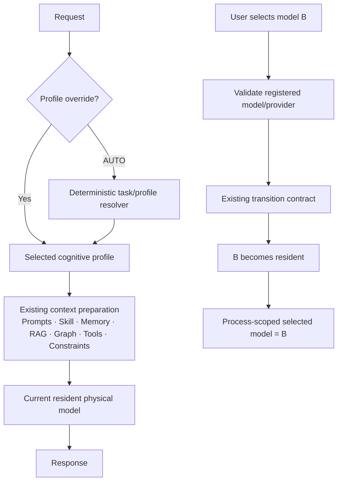

# AS-Core — Fase 1 / Subfase 1.3

## Single Resident Model Policy + Cognitive Profile Architecture Audit

> **Tipo:** auditoría de decisión arquitectónica; no implementación  
> **Fecha:** 2026-09-16  
> **HEAD auditado:** `7b9191c534cac169f31681a8d38457bb43309986`  
> **Baseline congelado:** `8825ca2`  
> **Decisión:** `GREEN — SINGLE RESIDENT MODEL RECOMMENDED`  
> **Estado:** `GREEN / ARCHITECTURAL DECISION READY`

La conclusión no es “AS-Core debe ser monomodelo”. La conclusión es más limitada y reversible: en el hardware y con la evidencia actualmente disponible, el runtime debe conservar toda su capacidad multimodelo, pero Core no debe decidir automáticamente el modelo físico por request. Debe existir un modelo físico seleccionado y residente, controlado explícitamente por el usuario, mientras Core automatiza la preparación de la tarea mediante perfiles, prompts, contexto, RAG, Graph, Skills, Tools y restricciones de salida.

---

## 1. STATUS

**GREEN / ARCHITECTURAL DECISION READY.**

Se cumplieron los criterios de auditoría:

- Fase 0 permanece protegida y no fue modificada.
- La evidencia cruda de 1.2 fue contrastada con los tres JSON de resultados.
- La hipótesis fue sometida a argumentos de refutación, no asumida.
- Se compararon política multimodelo automática y política de único residente.
- Se separaron modelo físico, alias lógico, perfil cognitivo y preset de generación.
- Se auditaron selección manual, UI, API, persistencia, restart, Skills, SmartRouter y multiusuario.
- Se diseñaron pruebas RED futuras sin crearlas.
- No se ejecutaron benchmarks nuevos ni se modificó código productivo.

Este GREEN autoriza una decisión de diseño para una futura 1.4. No autoriza implementación, auto-swap, eliminación de proveedores ni afirmaciones universales sobre E2B.

## 2. HEAD / BASELINE

| Elemento | Evidencia |
|---|---|
| Rama | `main` |
| HEAD | `7b9191c` — `docs: record Phase 1 Subphase 1.1 forensic model intelligence audit` |
| Baseline Fase 0 | `8825ca2` — hardening 0.2D |
| Relación | `8825ca2` es ancestro de HEAD |
| Documentación Fase 0 posterior | `624ea07` — actualización de README/ROADMAP |
| Checkpoints previos | `efc2f9a` residencia E2B; `7431777` identidad/aliases; `932b920` transición genérica; `8825ca2` lifecycle |
| Estado de rama | `main...origin/main [ahead 6]` |

Los hashes históricos siguen siendo válidos, pero HEAD avanzó mediante commits documentales. Por eso la auditoría usa HEAD real y conserva `8825ca2` como baseline técnico congelado.

## 3. FILES INSPECTED

Documentación y evidencia:

- `dev-notes/FASE_0_RUNTIME_LIFECYCLE_BASELINE.md`
- `docs/AUDITORIA_FORENSE_MODELOS_FASE_1.1.md`
- `docs/MODEL_CAPABILITY_EVIDENCE_FASE_1.2.md`
- `benchmarks/phase_1_2_dataset.json`
- `benchmarks/phase_1_2_harness.py`
- `benchmarks/results/phase_1_2_e2b.json`
- `benchmarks/results/phase_1_2_olmoe.json`
- `benchmarks/results/phase_1_2_qwen.json`

Runtime, configuración y API:

- `config.yaml`
- `config/inference_profiles.py`
- `config/settings.py`
- `core/engine.py`
- `providers/registry.py`
- `api/main.py`
- `api/models.py`
- `api/routes.py`
- `api/streaming.py`
- `router/smart_router.py`
- `router/rules.py`
- `runtime/coordinator/manager.py`
- `runtime/coordinator/models.py`
- `runtime/coordinator/prompts.py`
- `runtime/coordinator/agent.py`
- `runtime/skills/models.py`
- `runtime/skills/temporary.py`
- `runtime/skills/factory.py`
- `api/skill_routes.py`

UI y contratos de prueba:

- `ui/index.html`
- `ui/app.js`
- `ui/skills_ui.js`
- `tests/test_model_residency.py`
- `tests/test_model_transitions_contract.py`
- `tests/test_cross_provider_physical.py`
- `tests/test_lifecycle_hardening.py`
- `tests/test_p2_ui_model_validation.py`
- `tests/test_agent_loop_hardening.py`

También se inspeccionaron `git status`, el log relevante, estadísticas de commits y la relación de ancestro del baseline. No se ejecutaron modelos ni benchmarks en 1.3.

## 4. PHASE 1.2 EVIDENCE VALIDATION

Los conteos se recalcularon desde `model_evidence.cases[].evaluation.status` de cada JSON, no desde los valores aproximados del prompt.

| Modelo físico | PASS | PARTIAL | FAIL | BLOCKED | Resultado cognitivo agregado |
|---|---:|---:|---:|---:|---|
| Gemma 3n E2B int4 | 10 | 1 | 1 | 0 | Mejor cobertura observada; gaps en summarization y constraint reasoning |
| OLMoE 1B-7B Q4_K_M | 1 | 0 | 11 | 0 | Sólo una prueba pasó; evidencia insuficiente para reemplazar E2B |
| Qwen 1.5 MoE Q4_K_M | 1 | 1 | 10 | 0 | Cobertura baja y presión de memoria crítica |
| Gemma E4B | 0 | 0 | 0 | 12 | Capacidad cognitiva no verificada por restricción operacional |

Matriz por capability confirmada:

| Capability | E2B | OLMoE | Qwen MoE | E4B |
|---|---|---|---|---|
| Summarization | PARTIAL | FAIL | PARTIAL | BLOCKED |
| Structured extraction | PASS | PARTIAL | FAIL | BLOCKED |
| Grounded answering | PASS | FAIL | FAIL | BLOCKED |
| Constraint reasoning | PARTIAL | FAIL | FAIL | BLOCKED |
| Code generation | PASS | FAIL | PARTIAL | BLOCKED |
| Tool protocol | PASS | FAIL | FAIL | BLOCKED |

Evidencia operacional actual:

| Modelo/provider | Cold TTFT | Cold elapsed | Warm TTFT mediana | Warm elapsed mediana | VRAM máxima | RAM disponible mínima | Estado observado |
|---|---:|---:|---:|---:|---:|---:|---|
| E2B / LiteRT embedded | 8.107 s | 10.554 s | 0.533 s | 1.654 s | 3610 MB | 7754 MB | residente saludable; reclaim Dawn diferido |
| OLMoE / llama.cpp | 77.117 s | 82.512 s | 1.045 s | 2.136 s | 2671 MB | 4122 MB | funcional; cold actual alto |
| Qwen / llama.cpp | 110.280 s | 115.996 s | 2.232 s | 4.844 s | 3907 MB | 377 MB | degradado; presión crítica |
| E4B / LiteRT CLI | no ejecutado | no ejecutado | no ejecutado | no ejecutado | no medido | no medido | constraint operacional |

El audit de SmartRouter produjo 2 decisiones claramente correctas, 2 neutrales y 8 misleading. Detectó falsos positivos por palabras como `json`, `api` o `plan`, y falsos negativos para razonamiento en español y SQL. Tampoco conoce estado del provider, costo de transición ni resultados de capacidad.

La regresión de Fase 0 registrada en 1.2 fue 19/19 antes y 19/19 después. Esta auditoría no repitió esas pruebas porque no cambia producción y tiene prohibido continuar benchmarks.

## 5. CURRENT MODEL ARCHITECTURE

La arquitectura actual contiene cuatro conceptos parcialmente acoplados:

1. **Modelo físico:** artifact + provider; por ejemplo, E2B en `litert_embedded`.
2. **Modelo lógico/rol:** `chat`, `code`, `reasoning`, `olmoe`, `moe_large`.
3. **Prompt/task behavior:** `GENERAL_PROMPT`, `BUSINESS_PROMPT`, `SOFTWARE_PROMPT`, Skills, RAG, Graph y Memory.
4. **Preset de generación:** `PRECISE`, `BALANCED`, `CREATIVE`.

`chat` y `code` apuntan al mismo artifact E2B y al mismo provider. `reasoning` apunta a E4B/LiteRT CLI; `olmoe` y `moe_large` a artifacts llama.cpp distintos. EngineManager registra todos y aplica identidad física canónica, residencia y transición segura.

La separación ya existe, pero el hot path vuelve a mezclarla: el rol elegido por SmartRouter influye en modelo físico, prompt, preset, RAG mode/pipeline y capability gate. Esa mezcla es la deuda principal que 1.4 deberá desacoplar sin tocar los invariantes de Fase 0.

## 6. CURRENT MODEL SELECTION FLOW

Flujo actual real:

```text
POST /v1/chat/completions
  body.model == "auto" ? SmartRouter keywords : explicit model id
        ↓
logical model id (chat/code/reasoning/...)
        ↓
PureCoordinator: prompt family + Skill + Memory + RAG + Graph + capability gate
        ↓
inferred mode → PRECISE/BALANCED/CREATIVE
        ↓
optional X-Runtime-Preset override
        ↓
InferenceRequest(model_id=logical id)
        ↓
EngineManager._ensure_model_loaded
        ↓
reuse same physical identity or execute protected transition
```

El segundo valor devuelto por `SmartRouter.route()` —su system prompt— se descarta en `api/routes.py`; el prompt efectivo se recompone en Coordinator. Esto convierte parte de la responsabilidad documentada del router en código sin efecto sobre el camino principal.

El request expone `temperature`, `top_p` y `max_tokens`, pero la ruta productiva los sustituye con un preset. Por tanto, la semántica efectiva está controlada por preset/skill/model y no por esos campos del body.

## 7. MULTI-MODEL RUNTIME AUDIT

**KEEP / PROTECTED.** La infraestructura multimodelo aporta valor independiente de quién decide cambiar:

- registro de modelos y providers;
- identidad física canónica;
- residencia real;
- alias reuse (`chat ↔ code` sin recarga);
- transición cross-provider;
- secuencia release/load/verify/commit;
- estado consistente ante fallo de destino;
- Busy Guard y máximo de una inferencia;
- serialización de cargas incompatibles;
- unload, lifetime y shutdown;
- modo `single_user` soportado y `multi_user` fail-fast.

La propuesta no es `SINGLE MODEL RUNTIME`. Es `SINGLE RESIDENT MODEL POLICY`: el runtime puede cargar cualquiera de los modelos registrados, pero sólo cambia por una acción explícita y segura.

No hay evidencia que justifique modificar EngineManager. De hecho, la reversibilidad depende de conservarlo sin cambios.

## 8. AUTO MULTI-MODEL POLICY AUDIT

La cadena propuesta previamente —task requirements → capability matching → candidate ranking → swap-cost evaluation → recommendation → transition— resolvería un problema sólo si existieran simultáneamente:

- gaps materiales y repetibles del residente;
- otro modelo verificado que cubra esos gaps;
- estado operacional aceptable del candidato;
- beneficio mayor que el costo y riesgo de transición;
- señales suficientemente precisas para reconocer la tarea.

La evidencia actual no satisface esas condiciones. E2B tiene gaps, pero OLMoE y Qwen no los cubren de forma demostrada y E4B está sin evidencia cognitiva segura. SmartRouter, además, fue misleading en 8/12 casos.

Por tanto, una política automática añadiría componentes y estados sin un destino alternativo respaldado por evidencia. El problema probado hoy no es “Core elige poco”; es “Core puede elegir erróneamente y provocar transiciones costosas”.

La refutación a esta conclusión sería válida si una futura matriz demuestra que un modelo especializado supera al residente en una tarea crítica, con operación saludable y transición tolerable. En ese escenario, auto-multimodel volvería a ser una opción justificable. Hoy no lo es.

## 9. SINGLE RESIDENT POLICY AUDIT

La política propuesta satisface el problema actual con menos autoridad automática:

- un modelo físico seleccionado permanece residente;
- todos los perfiles operan sobre ese residente;
- el usuario puede seleccionar otro modelo registrado;
- el cambio explícito reutiliza el contrato de transición existente;
- Core no revierte el modelo por clasificación de texto, Skill o perfil;
- unload, shutdown y fallos siguen bajo el runtime.

Ventajas respaldadas por evidencia:

- evita usar un router lexical poco fiable como detonador físico;
- conserva el TTFT warm del residente en tareas heterogéneas;
- elimina transiciones inesperadas del camino normal;
- hace predecible qué artifact procesa datos y qué latencia esperar;
- reduce estados de fallo y combinatoria de pruebas;
- mantiene abierta la elección manual y la evolución de modelos.

Límites:

- no corrige el FAIL de E2B en constraint reasoning;
- traslada al usuario parte de la responsabilidad de elegir;
- necesita una semántica clara de “seleccionado” distinta de “activo”;
- no resuelve multiusuario, concurrencia ni fairness;
- no debe presentar perfiles como sustituto de capacidad real.

## 10. E2B DEFAULT ANALYSIS

**E2B debe ser el default en esta máquina/configuración, no una dependencia arquitectónica.**

Razones locales:

- obtuvo 10 PASS, 1 PARTIAL y 1 FAIL, la cobertura más fuerte del dataset;
- mostró TTFT warm mediano de 0.533 s y elapsed warm mediano de 1.654 s;
- su provider embedded cumple residencia real y alias reuse;
- `chat` y `code` ya comparten su identidad física;
- Fase 0 protege su ciclo de vida y las pruebas 1.2 no introdujeron regresiones;
- aunque observó 3610 MB de VRAM, mantuvo RAM disponible muy superior a Qwen y estado funcional.

Reservas:

- el dataset es pequeño y local;
- E2B tuvo una respuesta FAIL y una PARTIAL;
- el reclaim de VRAM Dawn es diferido;
- el comportamiento no se puede extrapolar a otro hardware, provider o workload.

Formulación correcta: **E2B posee actualmente la evidencia más fuerte para actuar como default en el perfil de hardware probado.**

## 11. CHAT/CODE/REASONING MAP

| Rol lógico actual | Identidad física | Prompt/pipeline | Preset efectivo típico | Capability gate | Observación |
|---|---|---|---|---|---|
| `chat` | E2B embedded | General/Business según Skill; RAG `normal/chat` | API sin header tiende a `CREATIVE`; UI manda `BALANCED` por default | `off` por `model_type=general` | Rol mezcla conversación con política de sampling |
| `code` | mismo E2B embedded | fuerza `SOFTWARE_PROMPT`; RAG `code/code` | `PRECISE` | `on_if_skill` por `model_type=coding` | Evidencia fuerte de PROFILE != MODEL |
| `reasoning` | E4B vía LiteRT CLI | no existe prompt family de reasoning propio; RAG `thinking/chat` | `BALANCED` | `on_if_skill` | Acopla requisito abstracto a un modelo degradado/no verificado |

Dos hallazgos importantes:

1. `chat ↔ code` cambia conducta sin cambiar artifact. El contrato de alias físico ya prueba que ese patrón funciona.
2. `reasoning` no tiene hoy suficiente justificación como selector físico automático. Debe evolucionar conceptualmente hacia requisito de tarea/overlay, manteniendo temporalmente el ID lógico por compatibilidad hasta una migración probada.

No debe eliminarse `reasoning` en 1.3 ni afirmarse que E4B carece de capacidad. La evidencia sólo dice que no está verificada de forma operacionalmente segura en esta máquina.

## 12. PROFILE ARCHITECTURE

Definiciones:

```text
MODEL   = artifact físico + provider + identidad/residencia/lifecycle
PROFILE = configuración conductual aplicable al modelo residente
PRESET  = subconjunto de parámetros de generación
TASK PREPARATION = prompts + contexto + constraints + Skills/Tools/RAG/Graph
```

Un perfil puede componer prompt family, instrucciones, preset, disponibilidad de herramientas y restricciones de salida. No debe contener un `model_id` obligatorio ni provocar una transición.

La representación mínima recomendada es:

- perfiles visibles: `AUTO`, `BALANCED`, `CREATIVE`, `CODE`;
- presets internos existentes: `BALANCED`, `CREATIVE`, `PRECISE`;
- `CODE` compone `SOFTWARE_PROMPT` + `PRECISE` + conducta de código;
- extracción estructurada puede seguir siendo BALANCED con constraints/preset PRECISE, sin fingir que toda extracción es CODE;
- prompt family y output constraints siguen siendo capas explícitas, no sinónimos del perfil.

Esto evita crear un cuarto preset duplicado llamado `CODE` y evita reducir creatividad a una temperatura.

Existe una clase `InferenceProfile` en `config/inference_profiles.py`, pero está ligada a `model_id`, sólo define `chat`/`code` y no tiene consumidores fuera del propio archivo. No debe tomarse como implementación vigente ni extenderse automáticamente; su nombre coincide con el concepto futuro pero su semántica es distinta.

## 13. BALANCED PROFILE

BALANCED debe ser el fallback general y representar conducta estable para conversación profesional, documentos, RAG, Graph, extracción y tareas empresariales.

Piezas ya disponibles:

- `GENERAL_PROMPT` y `BUSINESS_PROMPT`;
- preset `BALANCED` (`temperature=0.5`, `top_k=40`, `top_p=0.95`, `max_tokens=4096`);
- ensamblado determinista de Skill, Memory, RAG y Graph;
- idioma y continuidad;
- constraints de salida del request/Skill.

No debe fijar siempre un único prompt family: una Skill empresarial puede escoger Business y una consulta general puede usar General. Tampoco debe impedir que una extracción use parámetros PRECISE como constraint puntual. BALANCED es la conducta base, no simplemente `temperature=0.5`.

## 14. CREATIVE PROFILE

CREATIVE merece existir como override visible por casos reales —redacción, marketing, brainstorming, storytelling y variación textual—, pero su implementación actual es incompleta.

Hoy existe:

- preset `CREATIVE` (`0.8/50/1.0/5120`);
- Skills `content_creator`/`marketing` que lo seleccionan;
- prompt family general o business según manifest.

No existe una prompt family creativa dedicada ni evidencia 1.2 que pruebe calidad creativa. Por eso no debe inventarse un prompt nuevo sólo para completar una simetría. Una futura 1.4 debe definir primero el contrato observable —diversidad, tono, cumplimiento de restricciones y no degradación factual— y luego decidir si basta el preset más instrucciones de Skill o si hace falta otra family.

Conclusión: **KEEP como perfil conceptual y override; VALIDATE antes de ampliar prompts.** “Creativo” no equivale por sí solo a temperatura alta.

## 15. CODE PROFILE

CODE es el perfil con mayor base arquitectónica ya existente:

- `code` y `chat` comparten E2B físico;
- `code` fuerza `SOFTWARE_PROMPT`;
- selecciona preset `PRECISE`;
- cambia RAG a `mode=code`, `pipeline=code`;
- su `model_type=coding` participa en capability gate;
- el test de alias prueba `chat → code → chat` con una carga física y cero unloads antes del shutdown.

Esto demuestra parcialmente `PROFILE != MODEL`. Sin embargo, la implementación actual todavía deriva esas diferencias de `model_id`. En 1.4, CODE debe expresar comportamiento sin requerir el alias físico `code`.

El Agent behavior relevante está en prompts, context pipeline y capability protocol. No se encontró un conjunto separado de herramientas exclusivo de `code`; la disponibilidad se deriva del gate y de Skills. Desacoplar exige pruebas para no abrir o cerrar Tools accidentalmente.

## 16. AUTO PROFILE SELECTION

AUTO puede implementarse conceptualmente sin clasificador LLM, scoring ni taxonomía grande. Mecanismo mínimo recomendado, en orden de prioridad:

1. override explícito de perfil;
2. Skill explícita y su `prompt_family`/contrato;
3. metadata estructurada del request, como formato/schema requerido;
4. contexto de operación ya conocido: workflow de código, tool contract, RAG/Graph;
5. fallback `BALANCED`.

Señales fuertes actuales:

- `programming` o `SOFTWARE_PROMPT` → CODE;
- `content_creator`/`marketing` o modo creativo explícito → CREATIVE;
- extracción/schema → BALANCED + constraints y preset PRECISE;
- resto → BALANCED.

RAG o Graph por sí solos no implican CREATIVE/CODE; preparan contexto. Una tool invocation tampoco debe seleccionar modelo y sólo debe alterar perfil si su contrato lo exige.

SmartRouter keyword scoring no debe ser la base de AUTO profile: sus 8/12 decisiones misleading muestran que trasladarlo intacto cambiaría de lugar el mismo problema. Las señales deben ser estructurales y conservadoras; ante ambigüedad, BALANCED.

## 17. MANUAL PROFILE OVERRIDE

UX conceptual:

| Opción | Semántica |
|---|---|
| `AUTO` | Core resuelve el perfil con señales deterministas; nunca el modelo físico |
| `BALANCED` | Usuario fija conducta general/profesional |
| `CREATIVE` | Usuario fija conducta creativa |
| `CODE` | Usuario fija conducta de ingeniería/código |

Encaja con la UI actual porque ya existe un selector separado de preset, pero requiere corregir lenguaje y semántica:

- el `auto` actual del selector de modelo significa auto-selección física;
- el futuro `AUTO` debe vivir en el selector de perfil;
- el selector de modelo debe ser siempre explícito;
- `PRECISE` puede quedar como detalle interno o control avanzado, no confundirse con perfil CODE.

Un override de perfil debe viajar por request/sesión y no cambiar `selected_model`, `active_model` ni identidad física.

## 18. CAPABILITY CONTRACT NEW ROLE

El Capability Contract de 1.2 sigue siendo valioso, pero cambia de decisión a preparación:

| Capability | Preparación de tarea propuesta | Lo que no puede prometer |
|---|---|---|
| Summarization | límites, cobertura, fidelidad y formato | corregir por prompt toda debilidad del modelo |
| Structured extraction | schema, validación, output constraints, preset PRECISE | convertir extracción en “coding” o garantizar JSON perfecto |
| Grounded answering | RAG/Graph, provenance y prohibición de inventar | suplir evidencia ausente |
| Constraint reasoning | estructura explícita, pasos/constraints y contexto | crear capacidad de razonamiento inexistente |
| Code generation | perfil CODE, SOFTWARE_PROMPT, contexto de repo | asumir que cualquier modelo soporta código bien |
| Tool protocol | contrato de tool, schema y capability gate | asumir soporte fiable sin benchmark |

La matriz también conserva dos usos fuera del hot path: advertir al usuario sobre modelos con evidencia débil y evaluar futuros modelos. No debe descartarse ni convertirse automáticamente en tabla de ruteo.

## 19. SMARTROUTER FUTURE ROLE

**Elección: C, con D como transición.**

- Corto plazo: **D — KEEP temporal sin ampliar.** No añadir keywords ni hacer que seleccione perfiles.
- Objetivo 1.4: retirar su autoridad para elegir modelo físico y reemplazarla por señales ya disponibles en Coordinator/API.
- Estado final: **C — reemplazo posterior**, no otro router sofisticado.

La lógica de override explícito es útil, pero no necesita scoring. Puede migrar a validación/control de modelo seleccionado. Los system prompts de SmartRouter ya no gobiernan el prompt principal, y su scoring produjo evidencia adversa.

La opción A trasladaría la deuda. La B sólo sería razonable si “task hints” se limita a datos deterministas; crear otra taxonomía lexical no aporta valor. Por mínima deuda, el resolver futuro debe vivir junto a las señales que ya ensambla Coordinator, no duplicarlas en SmartRouter.

## 20. SKILLS IMPACT

`SkillSpec.recommended_model` existe en creación, edición, manifest y UI, pero no fue encontrado como consumidor del SmartRouter o EngineManager en el hot path de chat. Es metadata pasiva.

Aplicando DELETE antes de añadir campos:

- no crear ahora `recommended_profile`;
- no activar `recommended_model` como selector físico;
- conservarlo temporalmente por compatibilidad de manifests/UI;
- marcarlo conceptualmente como legacy/deprecated en la futura migración;
- reutilizar primero `prompt_family`, `required_scopes` y `uses_capabilities`;
- sólo añadir un requisito de modelo si existe incompatibilidad dura, demostrada y no expresable como capability.

Una Skill puede recomendar conducta, pero no debe forzar silenciosamente un modelo bloqueado/degradado. Si una Skill realmente depende de un artifact específico, debe fallar de forma explícita o pedir selección humana; ese caso requiere evidencia antes de diseñar un campo nuevo.

## 21. USER MODEL SELECTION FLOW

### Estado actual

- La UI expone `auto`, `chat`, `code`, `reasoning`, `olmoe` y `moe_large`.
- Cada request envía el valor como `body.model`.
- No existe endpoint dedicado de selección/carga; el cambio ocurre de forma lazy al inferir.
- `GET /v1/models` enumera modelos registrados.
- `GET /v1/status` refleja `active_model` real del EngineManager.
- El provider se obtiene de la entrada del modelo en `config.yaml` y ProviderRegistry.
- La UI sincroniza dos selectores, pero no persiste la selección en `localStorage`.
- El backend no conserva una preferencia `selected_model`; sólo conoce el modelo físicamente activo.
- Tras restart, `api/main.py` hace warmup asíncrono de `chat`; la UI vuelve a su opción HTML `auto`.

Por tanto, hoy “manual” significa override repetido por request/página, no preferencia persistente del runtime. Si la página sigue abierta y mantiene B, los requests futuros siguen enviando B. Al recargar o volver a `auto`, SmartRouter puede llevar la siguiente request a otro modelo.

### Contrato mínimo futuro

```text
User selects registered model B
        ↓
validate model/provider availability
        ↓
existing EngineManager transition on explicit operation/request
        ↓
B becomes active resident model
        ↓
process-scoped selected_model = B
        ↓
future requests use B under any profile
        ↓
Core never automatically reverts to A
```

La fuente de verdad de `selected_model` debe estar fuera de EngineManager —control plane/API app state— porque EngineManager debe seguir reportando realidad física, no preferencia UX. Para 1.4, persistencia mínima puede ser process-scoped: tras restart se vuelve al default E2B. Persistencia durable entre restarts es una decisión UX/config posterior y debe ser explícita, no inferida del último `active_model`.

## 22. MULTIUSER IMPACT

Single Resident reduce una futura dimensión de arbitraje, pero **no implementa multiusuario**.

Problemas que desaparecen o se reducen:

- User A no puede disparar silenciosamente un swap físico que perjudique a User B;
- no hay ranking de modelos por usuario/request;
- no hacen falta hysteresis, cooldown o minimum residency para resolver competencia automática;
- latencia y capacidad son más homogéneas mientras el residente no cambia;
- el modelo activo puede ser una política administrativa/global conocida.

Problemas que permanecen:

- cola y fairness;
- concurrencia y backpressure;
- cancelación y ownership de requests;
- aislamiento de sesiones, Memory, RAG y Graph;
- presupuesto de CPU/GPU/RAM por usuario;
- seguridad y scopes de Tools;
- decisión de quién tiene autoridad para cambiar el modelo global;
- tareas legítimas que requieren modelos distintos;
- mantenimiento durante explicit transitions.

El runtime actual sigue siendo `single_user`, máximo una inferencia, y `multi_user` falla inmediatamente. La política recomendada facilita un diseño futuro, pero no cambia ese estado.

## 23. LATENCY COMPARISON

### Auto multimodel

```text
request → classify → requirements → candidates → cost/state → recommend
        → maybe release/load/verify/commit → inference
```

### Single resident

```text
request → deterministic profile/task preparation → resident inference
```

No se inventan microbenchmarks para clasificación. El dato material es la transición/cold path:

- E2B warm TTFT mediano: 0.533 s.
- OLMoE cold TTFT actual: 77.117 s.
- Qwen cold TTFT actual: 110.280 s.
- evidencia histórica de transición E2B→OLMoE: aproximadamente 4.1 s, OLMoE→E2B: 3.8 s.
- E2B→E4B histórica: aproximadamente 180 s y degradada.

Cold TTFT y costo de transición pareada no son la misma métrica, pero ambas prueban que salir del residente puede dominar la latencia. Single Resident no elimina el costo cuando el usuario cambia explícitamente; lo elimina del camino normal y lo vuelve predecible.

## 24. FAILURE SURFACE COMPARISON

| Superficie | Auto multimodel | Single resident |
|---|---|---|
| Clasificación errónea | puede causar swap físico | como máximo perfil subóptimo |
| Escalation/downgrade incorrecto | presente | ausente del hot path |
| Thrashing | requiere policy/hysteresis | ausente salvo acciones explícitas repetidas |
| Benchmark/cost stale | puede decidir el runtime | informa al usuario, no decide automáticamente |
| Candidate/provider degradado | puede seleccionarse por error | sólo por selección explícita/validada |
| Transition failure | posible en requests normales | limitado a cambio explícito |
| Alias/physical identity | crítico en ambas | protegido por Fase 0 |
| Perfil incorrecto | presente | presente, pero no recarga artifact |
| Tool/capability gate incorrecto | presente | presente y debe desacoplarse de model_type |
| Unload/shutdown/provider failure | presente | presente |
| Preferencia vs realidad física | presente | requiere contrato explícito de selected/active |
| Multiuser arbitration | alta complejidad | reducida, no eliminada |

Lo que desaparece es la composición “decisión cognitiva incierta + mutación física costosa”. No desaparecen lifecycle, provider failures, perfil equivocado ni limitaciones del modelo residente.

## 25. USER CONTROL BOUNDARY

Frontera recomendada:

| Owner | Responsabilidad |
|---|---|
| Core | perfil, prompts, contexto, RAG, Graph, Skills, Memory, Tools, schema/output constraints |
| User/administrador | preferencia de modelo físico y cambio explícito |
| Runtime | registro, validación, residencia, transición, Busy Guard, lifecycle y estado real |

Ventajas:

- autoridad comprensible y auditable;
- latencia y privacidad más predecibles;
- Core puede mejorar preparación sin acoplarse a artifacts;
- el runtime conserva seguridad operacional;
- el usuario puede adoptar modelos futuros sin reescribir Core.

Riesgos:

- usuarios sin conocimiento técnico pueden elegir mal;
- una elección global no satisface todos los workloads;
- la UI debe explicar evidencia/estado sin convertirse en recomendador automático encubierto;
- una Skill puede necesitar una capacidad que el residente no ofrece.

La frontera es estable si la selección humana es informada, validada y explícita, y si Core falla honestamente ante incompatibilidad en lugar de hacer swap silencioso.

## 26. FUTURE MODEL COMPATIBILITY

Cuando aparezca un modelo mejor que E2B, el flujo esperado es:

```text
register → validate provider/lifecycle → benchmark with capability contract
        → expose evidence/status → user selects → existing transition → resident
```

Core no debería cambiar porque perfiles, RAG, Graph, Skills y output constraints apuntan al modelo residente mediante contratos provider-agnostic. Sólo harían falta adaptaciones si el nuevo modelo tiene una interfaz/capability realmente diferente; eso pertenece al provider o a capability negotiation, no a hardcodear E2B.

La política también permite un futuro “Advisor” no autoritativo: puede mostrar recomendaciones, pero la transición sigue requiriendo confirmación. Si evidencia posterior justifica auto-selection, el advisor puede insertarse sobre el contrato de transición sin modificar EngineManager.

## 27. PRE-MORTEM SINGLE RESIDENT

| # | Riesgo: la política falló porque… | Probabilidad | Impacto | Detectabilidad | Mitigación conceptual |
|---:|---|---|---|---|---|
| 1 | el usuario eligió un modelo muy malo | Media | Alto | Fácil con harness/feedback | mostrar estado/evidencia y permitir volver al default |
| 2 | el residente no soportó Tools | Media | Alto | Fácil con contract test | capability gate honesto; bloquear Tool antes de ejecutar |
| 3 | falló una capability crítica | Alta para algún workload | Alto | Media | contract por tarea, observabilidad y cambio manual explícito |
| 4 | el usuario no supo qué elegir | Alta | Medio | Fácil por UX/telemetría | default seguro y explicaciones no autoritativas |
| 5 | un nuevo modelo superó claramente al default | Alta a largo plazo | Medio | Fácil con benchmark periódico/manual | registro + 1.2 harness + actualización del default |
| 6 | una tarea excepcional necesitó modelo especializado | Media | Alto | Media | selección explícita y advertencia; no ocultar incapacidad |
| 7 | el perfil no compensó falta real de capacidad | Alta cuando existe gap | Alto | Difícil sin eval | afirmar límites; perfiles preparan, no crean capacidad |
| 8 | E2B pasó el dataset pero falló en producción | Media | Alto | Media | ampliar dataset con fallos reales, no auto-generalizar |
| 9 | AUTO profile se convirtió en otro SmartRouter complejo | Media | Medio | Fácil por tamaño/reglas | sólo señales estructurales, fallback BALANCED, DELETE scoring |
| 10 | modelo y perfil manuales confundieron la UX | Media | Medio | Fácil con tests de usuario | selectores separados y lenguaje physical/behavior claro |
| 11 | multiusuario necesitó modelos diferentes | Media futura | Alto | Fácil al diseñar tenancy | autoridad administrativa o pools; no prometer solución actual |
| 12 | selected model se persistió mal o quedó stale | Media | Alto | Media | separar selected/active; validar en startup; fallback explícito |
| 13 | una Skill dependía de un modelo específico | Baja hoy | Alto | Difícil si metadata es informal | capability explícita/fail truthful; requisito sólo con evidencia |

El pre-mortem refuta una versión fuerte de la hipótesis: un residente no es siempre suficiente, ni el usuario siempre decide bien. La versión recomendada sobrevive porque conserva transición multimodelo, evidencia, cambio manual y reversibilidad.

## 28. PRE-MORTEM AUTO MULTIMODEL

| Riesgo: la política automática falló porque… | Probabilidad | Impacto | Detectabilidad | Mitigación necesaria si se retomara |
|---|---|---|---|---|
| clasificación lexical equivocó la tarea | Alta con evidencia actual | Alto | Media | señales estructurales/evals; no keywords aisladas |
| capability matrix quedó obsoleta | Media | Alto | Difícil | versionado por artifact/provider/hardware/dataset |
| costo estimado no representó transición real | Alta | Alto | Difícil | telemetría pareada y calibración por máquina |
| candidato “mejor” estaba degradado/bloqueado | Media | Alto | Fácil si health es confiable | hard exclusions y health freshness |
| release/load falló durante request normal | Media | Alto | Fácil | Fase 0 limita inconsistencia, no el impacto UX |
| thrashing entre tareas cortas | Media | Alto | Fácil | hysteresis, cooldown, minimum residency |
| hysteresis impidió un cambio útil | Media | Medio | Difícil | policy tuning adicional |
| ranking multiplicó la matriz de tests | Alta | Alto | Fácil | contract combinatorio por modelo/provider/hardware |
| hardware distinto invalidó benchmarks | Alta | Alto | Difícil | perfiles/evidencia específicos por máquina |
| usuario perdió predictibilidad/control | Media | Alto | Fácil | explainability y override, más estados UI |
| dos usuarios compitieron por modelos | Alta en multiuser | Alto | Fácil | scheduler/arbitration no existente |
| mantenimiento del Advisor superó el valor | Alta hoy | Alto | Fácil con roadmap/costo | no implementarlo hasta probar beneficio |

Continuar ahora con ModelAdvisor obligaría a implementar ranking, cost model, exclusions, freshness, hysteresis, UI explicativa y una matriz de tests, antes de tener un segundo modelo que demuestre valor cognitivo. Ese orden viola DELETE y SIMPLIFY.

## 29. FIVE-STEP ANALYSIS

### 1 — QUESTION REQUIREMENTS

¿Qué problema probado resuelve cambiar automáticamente? Ninguno en la evidencia actual. E2B tiene gaps, pero no hay candidato alternativo verificado que los resuelva de forma operacionalmente aceptable. Sí existe un problema probado: SmartRouter es misleading y las transiciones/cold starts pueden ser costosas.

### 2 — DELETE

Deferir ModelAdvisor, model scoring, automatic escalation/downgrade, candidate ranking, swap-benefit engine, hysteresis, cooldown y minimum-residency para auto-routing. No borrar runtime ni código en 1.3.

### 3 — SIMPLIFY / OPTIMIZE

Un residente seleccionado + perfiles cognitivos + selección manual. Separar selected model, active model, profile, prompt family y generation preset.

### 4 — ACCELERATE

Sacar del hot path evaluación de candidatos, estimación de swap y transición automática. Reutilizar el residente warm; limitar los cold/transition penalties a acciones explícitas.

### 5 — AUTOMATE

Automatizar perfil conservador, prompt family, contexto, RAG, Graph, Skills, Tools y output constraints. No automatizar el modelo físico hasta que evidencia futura justifique reabrir la decisión.

## 30. DECISION MATRIX

| Criterio | Opción A — Automatic multi-model recommendation | Opción B — Single resident + manual model + dynamic profiles |
|---|---|---|
| Complejidad de implementación | **HIGH**: Advisor, ranking, costs, health, policy, UI | **MEDIUM**: separar estado/modelo/perfil y migrar acoplamientos |
| Mantenimiento/riesgo | **HIGH**: datos stale y tuning por hardware | **MEDIUM**: contratos explícitos y pocos estados nuevos |
| Latencia runtime | variable; puede incluir swaps de segundos/minutos | estable en warm path; swap sólo explícito |
| Predictibilidad | baja ante clasificación/health/cost cambiante | alta mientras el residente no cambia |
| Control del usuario | override compite con automatismo | frontera directa y visible |
| Portabilidad de hardware | ranking/cost model debe recalibrarse | default/evidencia cambia; Core permanece |
| Modelos futuros | potente si existe evidencia y policy madura | se registran/benchmarkean/seleccionan sin reescribir Core |
| Preparación multiuser | añade arbitraje por request/usuario | reduce arbitraje físico, no resuelve concurrencia |
| Superficie de fallo | **HIGH** | **MEDIUM** |
| Carga de testing | combinatoria modelo×provider×task×cost×state | perfiles sobre residente + transición explícita ya protegida |
| Valor respaldado hoy | no demostrado | demostrado por residencia, alias reuse y evidencia 1.2 |

La Opción B gana por valor respaldado, no por preferencia abstracta por simplicidad. La Opción A sigue siendo técnicamente viable en el futuro.

## 31. REVERSIBILITY

La decisión es reversible si 1.4 respeta estas condiciones:

- EngineManager no cambia;
- ProviderRegistry y model registration se conservan;
- el contrato de transición explícita sigue siendo genérico;
- perfiles no contienen hardcode de E2B;
- Capability Contract sigue versionando evidencia por artifact/provider/hardware;
- selected model y active physical reality permanecen separados.

Un ModelAdvisor futuro puede insertarse como productor de recomendación o, con evidencia suficiente, de una orden confirmada. No necesita alterar release/load/verify/commit. Single Resident bloquearía el futuro sólo si se eliminaran providers/model registry o se codificara E2B dentro de Coordinator; esta auditoría prohíbe ambas cosas.

## 32. MINIMUM ARCHITECTURE



No se necesita una capa ModelAdvisor. El resolver mínimo puede integrarse en el lugar que ya ensambla señales de Coordinator/API. El control plane conserva selección; EngineManager conserva verdad física.

## 33. ROADMAP ITEMS TO DELETE/DEFER

**DEFER del roadmap inmediato:**

- ModelAdvisor;
- model scoring;
- capability-to-model automatic matching;
- candidate ranking;
- automatic escalation;
- automatic downgrade;
- swap-benefit scoring;
- transition-cost decision engine;
- hysteresis;
- cooldown;
- minimum-residency policy para auto-routing;
- LLM/neural classifier;
- ampliación de keyword taxonomy;
- scheduler de modelos para multiusuario.

“Defer” no significa prohibición permanente. Cada elemento necesita un trigger de reapertura: evidencia de un gap crítico, un candidato que lo cubra, operación saludable y beneficio superior al costo.

## 34. COMPONENTS TO KEEP

**KEEP / PROTECTED:**

- Fase 0 completa e invariantes I1–I10;
- ProviderRegistry y abstracción de providers;
- registro de modelos;
- identidad física y alias reuse;
- residencia y lifecycle;
- transición cross-provider y failure consistency;
- Busy Guard, load lock, unload y shutdown;
- inventario forense de 1.1;
- harness/dataset/resultados de 1.2;
- Capability Contract y mediciones específicas de máquina;
- evidencia adversa de SmartRouter;
- selección manual existente;
- prompt families, Coordinator, RAG, Graph, Memory, Skills y Tools;
- presets `PRECISE`, `BALANCED`, `CREATIVE` como piezas internas, sujetos a contrato.

El trabajo anterior no se pierde: cambia de “motor de selección automática” a “infraestructura segura, evidencia y preparación de tarea”.

## 35. FUTURE RED TEST PLAN

Una futura 1.4 debe comenzar con al menos estas pruebas RED:

1. el modelo default permanece físicamente residente al alternar perfiles;
2. `BALANCED → CODE` no incrementa physical load/unload;
3. `CODE → CREATIVE` no incrementa physical load/unload;
4. `AUTO` profile no cambia `active_physical_model`;
5. cambio explícito de usuario sí usa release/load/verify/commit;
6. tras cambio manual, el nuevo modelo se usa en requests de todos los perfiles;
7. Core no revierte automáticamente al default ni por Skill ni por keywords;
8. aliases conservan identidad física y no recargan;
9. las 19 pruebas de invariantes de Fase 0 permanecen GREEN;
10. modelo no registrado, bloqueado o provider no disponible falla truthful sin selección falsa;
11. override de perfil es determinista y domina AUTO;
12. no queda ningún camino oculto de recomendación/cambio físico en SmartRouter, Skill o Coordinator;
13. `selected_model` y `active_model` divergen sólo durante transición/fallo y se reportan honestamente;
14. restart vuelve al default documentado si la persistencia es process-scoped;
15. profile CODE conserva SOFTWARE_PROMPT/PRECISE sin depender del alias lógico `code`;
16. extraction usa schema/constraints sin ser clasificada como código;
17. Tools se abren por contrato/Skill, no por identidad física accidental;
18. UI separa selector físico de `AUTO/BALANCED/CREATIVE/CODE`;
19. clientes API sin header obtienen el mismo default de perfil que la UI;
20. cambio de perfil durante inferencia no solicita transición ni viola Busy Guard.

Las pruebas deben instrumentar load/unload y physical identity, no inferir ausencia de swap sólo por el string `active_model`.

## 36. FILE IMPACT FORECAST

### MUST CHANGE en 1.4

| Archivo/área | Motivo |
|---|---|
| `api/routes.py` | separar selección física de resolución de perfil; retirar SmartRouter físico del hot path |
| `api/models.py` | formalizar campo/contrato de profile y semántica de model/default |
| `ui/index.html` | separar selector físico de selector `AUTO/BALANCED/CREATIVE/CODE` |
| `ui/app.js` | enviar modelo seleccionado y profile sin mezclar; reflejar selected vs active |
| tests de API/UI/profile | proteger no-swap, overrides y truthful failures |

### MAY CHANGE

| Archivo/área | Condición |
|---|---|
| `router/smart_router.py` / `router/rules.py` | adaptador temporal o retiro posterior; no ampliar scoring |
| `runtime/coordinator/manager.py` | resolver perfil y desacoplar prompt/RAG/gate de `model_id` |
| `runtime/coordinator/prompts.py` | sólo si el contrato CREATIVE requiere family probada |
| `config/inference_profiles.py` | reemplazar/retirar estructura muerta si se adopta contrato nuevo |
| `config.yaml` / settings | default seleccionado o catálogo de perfiles, evitando mezclar hardware profiles |
| `api/main.py` | inicializar process-scoped selected model/default |
| `runtime/skills/*`, `api/skill_routes.py`, `ui/skills_ui.js` | deprecación compatible de `recommended_model`; no añadir campos sin necesidad |
| status response/UI telemetry | exponer selected/active/physical de forma diferenciada |

### SHOULD NOT CHANGE

- `core/engine.py` / EngineManager;
- providers y ProviderRegistry;
- physical identity;
- transition contract;
- Busy Guard y load lock;
- lifecycle/unload/shutdown;
- tests congelados de Fase 0, salvo agregarlos al suite de regresión;
- implementaciones RAG, Graph y Memory que no dependan de rol físico;
- capability harness/resultados de 1.2.

La mención de archivos es forecast, no autorización de cambios.

## 37. FILES MODIFIED

En Fase 1.3 se creó solamente:

- `docs/SINGLE_RESIDENT_MODEL_POLICY_FASE_1.3.md`

No se modificó ningún archivo productivo, test, benchmark, configuración, EngineManager, provider, SmartRouter, SkillSpec, API o UI.

Los artefactos untracked de 1.2 se preservaron intactos y no se incorporaron ni reescribieron como parte de 1.3.

## 38. GIT STATUS

Estado inicial observado:

```text
## main...origin/main [ahead 6]
?? benchmarks/phase_1_2_dataset.json
?? benchmarks/phase_1_2_harness.py
?? benchmarks/results/
?? docs/MODEL_CAPABILITY_EVIDENCE_FASE_1.2.md
```

Estado final observado al cierre de 1.3: los mismos artefactos 1.2 más este documento nuevo:

```text
## main...origin/main [ahead 6]
?? benchmarks/phase_1_2_dataset.json
?? benchmarks/phase_1_2_harness.py
?? benchmarks/results/
?? docs/MODEL_CAPABILITY_EVIDENCE_FASE_1.2.md
?? docs/SINGLE_RESIDENT_MODEL_POLICY_FASE_1.3.md
```

La advertencia de Git sobre acceso a `C:\Users\rva10\.config\git\ignore` es ambiental y no altera el inventario del working tree.

## 39. RISKS

Riesgos residuales principales de la decisión:

- **Capacidad:** E2B no cubre perfectamente todas las tareas; profiles no crean capacidad.
- **Evidencia:** 12 casos no representan producción completa.
- **UX:** dos selectores y el término AUTO pueden confundirse si no se migran con claridad.
- **Estado:** selected, active lógico y active físico deben tener contratos separados.
- **Tools:** el gate actual depende de `model_type`; desacoplarlo puede causar regresiones de seguridad/funcionalidad.
- **Compatibilidad:** `recommended_model`, alias `code/reasoning` y clientes que envían `model=auto` requieren migración gradual.
- **Restart:** hoy vuelve a `chat`; persistencia durable no está definida y no debe aparecer por accidente.
- **Hardware:** el default local puede ser incorrecto en otra máquina.
- **Multiuser:** sigue reservado; un único residente no resuelve scheduling ni isolation.
- **Roadmap drift:** AUTO profile podría recrear SmartRouter bajo otro nombre si se permite scoring lexical creciente.
- **Complacencia:** simplificar ahora no debe impedir reabrir auto-multimodel cuando aparezca evidencia fuerte.

Guardrail decisivo: ninguna future Skill, profile o capability puede cambiar el modelo físico de manera implícita.

## 40. FINAL VERDICT

### GREEN — SINGLE RESIDENT MODEL RECOMMENDED

La evidencia actual no justifica el costo arquitectónico de:

```text
TASK → MODEL SELECTION → RECOMMENDATION → SWAP
```

Sí justifica:

```text
TASK → PROFILE + TASK PREPARATION → CURRENT RESIDENT MODEL
```

Motivos determinantes:

1. E2B aporta la mejor evidencia local, pero no es universal ni perfecto.
2. No existe hoy un modelo alternativo verificado que cubra sus gaps con operación aceptable.
3. SmartRouter fue misleading en 8/12 casos y no conoce capacidad, health ni costo.
4. Las penalidades observadas de cold/transition son materiales.
5. `chat/code` ya demuestra que conducta distinta puede reutilizar una identidad física.
6. Fase 0 ya proporciona todo el mecanismo seguro necesario para cambios explícitos.
7. El diseño es reversible: un Advisor futuro puede añadirse sin modificar EngineManager.

Decisión de roadmap:

- **KEEP:** multi-model runtime, manual model selection, evidencia/capabilities y transición segura.
- **RECOMMEND:** un modelo residente seleccionado, E2B como default sólo para esta máquina, perfiles dinámicos y override manual.
- **DEFER:** ModelAdvisor, ranking, scoring, auto escalation/downgrade, swap-cost engine, hysteresis y cooldown.
- **DO NOT CLAIM:** que E2B es universalmente mejor, que profiles resuelven incapacidad, o que multiusuario está solucionado.

**STOP. Esperar HUMAN REVIEW antes de Fase 1.4 o cualquier implementación.**
